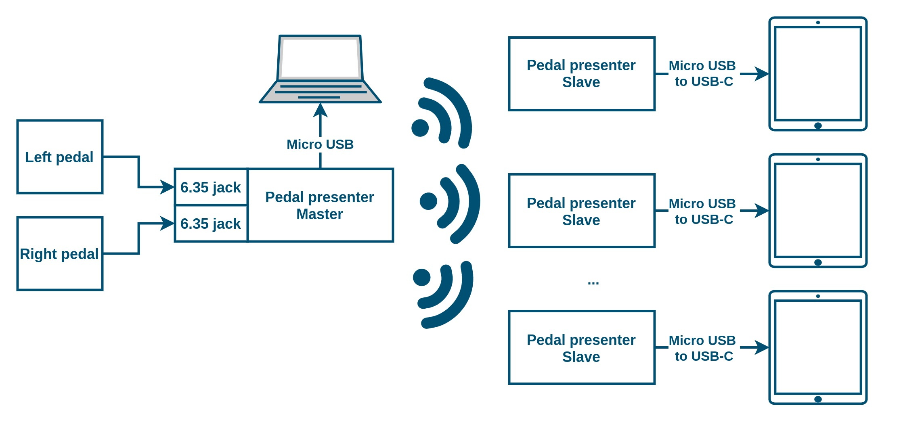

# Pedal-presentation-controller

## 1.0 Overview

The pedal presenter aims to control the computer or smartphone with pedals by emulating keyboard characters. The device acts as a physical keyboard and connects to the PC as an HID device. When the left or right pedal is pressed, the previously selected character is pressed (see 3.0 Modes section). The last chosen wireless status, mode and option are stored in permanent memory.

The device is mainly designed for musicians or presenters who would stop to change pages.

Figure 1. The high level architecture

## 2.0 Master module

The master module handles the two pedals, and broadcast the page number and the characters for the slave devices. The character is sent once when the pedal is pressed. To send another character the user should release the pedal and pressed again. Different modes (Section 2.2), the options (Section 2.3) can be selected with the encoders (Figure 2).

With the right pedal is stands for the "next" and the left pedal for the "backward".

Figure 2. Device views

## 2.1 Layouts

## 2.2 Modes

| ID  | Modes                    | LCD name | Left pedal | Right pedal | Sent X times |
| --- | ------------------------ | -------- | ---------- | ----------- | ------------ |
| 1   | Sends nothing (for test) | Nothing  |            |             |              |
| 2   | Left or right arrow      | LR_1x    | Left arrow | Right arrow | 1            |
| 3   | Page down or Up          | Pg_UD    | Page up    | Page down   | 1            |
| 4   | Up or Down arrow         | UD_7x    | Up arrow   | Down arrow  | 7            |
| 5   | Up or Down arrow         | UD_8x    | Up arrow   | Down arrow  | 8            |
| 6   | Up or Down arrow         | UD_9x    | Up arrow   | Down arrow  | 9            |

## 2.3. Options

| ID  | LCD name   | Modes                                             |
| --- | ---------- | ------------------------------------------------- |
| 1   | Wir-Off    | Turn off wireless                                 |
| 2   | Wir-On     | Turn on wireless                                  |
| 3   | Rst-pgNum  | Reset page number                                 |
| 4   | Rst+GoBack | Reset page counter + go back to original position |

## 2.4. Architecture

## 2.5 Wireless communication

The master sends 5 bytes to the slaves. First the start character, than the left key, than the right, and the Page Id MSB (Most significant byte), the Page Id LSB (Least significant byte) and the checksum.

| Bytes   | 0   | 1        | 2         | 3      | 4      | 5        |
| ------- | --- | -------- | --------- | ------ | ------ | -------- |
| Content | "m" | Left key | Right Key | Page_H | Page_L | Checksum |

## 3.0 Slave module

The slave modules are controlled via wireless communication. If the master sends the command, they comparing their local page counter with the received one, and they increase it by sending the left or right character. For example if the master sends page id 10, and the slave module page ID is 7, than it will send the character of the right pedal 3x times.

### Appendix

## 4. Pinout

| Arduino pins | Function   | Pheripheral     |
| ------------ | ---------- | --------------- |
| 2            | SDA        | LCD Display     |
| 3            | SCL        | LCD Display     |
| 4            | SW         | Feature Encoder |
| 5            | CH_A       | Feature Encoder |
| 6            | CH_B       | Feature Encoder |
| 7            | CH_B       | Keys Encoder    |
| 8            | SW         | Keys Encoder    |
| 9            | CH_A       | Keys Encoder    |
| A3           | SIG1       | Left Pedal      |
| A2           | SIG2       | Right Pedal     |
| A1           | CE         | NRF24L01        |
| A0           | CSN        | NRF24L01        |
| 15           | SCK        | NRF24L01        |
| 14           | MISO -> M1 | NRF24L01        |
| 16           | MOSI -> M0 | NRF24L01        |

## Peripherals

